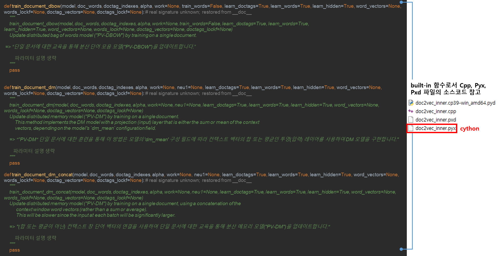

# Doc2vec 코드 분석

**Python 구현 부**

\_do\_train\_job() 함수에서 훈련 방법 3가지 중에서 설정해둔 훈련 방법으로 훈련 진행

<figure><figcaption>
Doc2vec 학습 코드 -  python
</figcaption></figure>

**Cython 구현부**

doc2vec\_inner.pyx 파일 中 PV-DM(Sum or Average) 훈련 함수 train\_document\_dm() 구현 Part.

1\) 객체 가져오기 및 초기 설정

<figure><figcaption></figcaption></figure>

2\) Dm 모델 구현 과정 (Cython)

<figure><figcaption></figcaption></figure>
